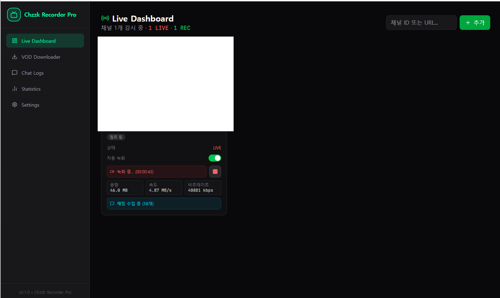
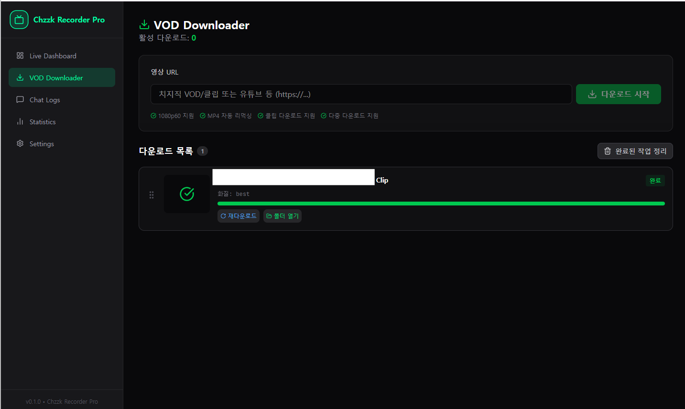

# Chzzk-Recorder-Pro


**Chzzk-Recorder-Pro**는 치지직(Chzzk), TwitCasting, Twitter(X) Spaces 라이브 스트리밍 녹화 및 VOD 다운로드를 위한 강력한 올인원 솔루션입니다.
안정적인 녹화 파이프라인, 직관적인 웹 대시보드, 실시간 채팅 아카이빙, 그리고 Discord 봇 연동 기능을 제공합니다.

---

## 📸 미리보기

| 대시보드 | VOD 다운로드 |
|:---:|:---:|
|  |  |

---

## ✨ 주요 기능

### 🎥 라이브 녹화 (Live Recording)
- **멀티 플랫폼**: 치지직(Chzzk), TwitCasting, Twitter(X) Spaces 동시 감시 및 녹화를 지원합니다.
- **자동 녹화**: 등록한 스트리머가 방송을 켜면 자동으로 녹화를 시작합니다.
- **안정성**: `Fragmented MP4` 기술을 적용하여 정전이나 프로세스 강제 종료 시에도 녹화된 파일이 손상되지 않습니다.
- **고화질**: 원본 화질(Best Quality)을 손실 없이 저장합니다.
- **즉시 스캔**: Dashboard의 「즉시 스캔」 버튼으로 폴링 주기를 기다리지 않고 즉시 채널 상태를 확인합니다.

### 💾 VOD 다운로드 (VOD Downloader)
- **다양한 소스**: 치지직 다시보기/클립뿐만 아니라 YouTube 등 외부 사이트 영상도 다운로드 가능합니다.
- **대기열 시스템**: 여러 영상을 대기열에 등록하고, 드래그 앤 드롭으로 우선순위를 변경할 수 있습니다.
- **이어받기**: 다운로드가 중단되어도 이어서 받을 수 있습니다.

### 📥 아카이브 다운로드 (Archive)
- **TwitCasting 과거 방송**: TwitCasting 채널의 과거 방송 목록을 조회하고 원하는 영상을 다운로드할 수 있습니다.
- **Twitter(X) Spaces**: 캡처된 master URL 또는 m3u8 URL을 사용해 Spaces 녹음을 다운로드할 수 있습니다.
- **Master URL 백업**: Space 감지 시 master URL을 `.txt` 파일로 자동 저장합니다. 다운로드에 실패해도 파일에서 URL을 확인해 수동으로 내려받을 수 있습니다.

### 💬 채팅 아카이빙 (Chat Archiving)
- **실시간 수집**: 라이브 녹화와 동시에 채팅 로그를 `.jsonl` 파일로 저장합니다.
- **웹 뷰어**: 내장된 뷰어를 통해 날짜별, 채널별 채팅을 검색하고 조회할 수 있습니다.

### 📊 통계 및 알림
- **대시보드**: 총 녹화 시간, 용량, 채널별 통계를 시각적으로 확인합니다.
- **Discord 봇**: 녹화 시작/종료, 다운로드 완료 알림 및 커맨드로 원격 제어가 가능합니다.

---

## 💻 시스템 요구사항

| 항목 | 최소 사양 | 권장 사양 |
|------|-----------|-----------|
| OS | Windows 10+, Ubuntu 20.04+, macOS 12+ | 최신 버전 |
| RAM | 2GB | 4GB 이상 |
| 디스크 | 500MB (앱) + 녹화 용량 | SSD 권장 |
| FFmpeg | 필수 (Windows: 자동 설치 지원) | 6.x 이상 |
| Python | 3.10+ (.exe 사용 시 불필요) | 3.12 |
| Node.js | 18+ (개발자용만 필요) | 20+ |

---

## 🚀 설치 및 실행

사용 환경에 맞는 방법을 선택하세요:

| 환경 | 방법 | 난이도 |
|------|------|--------|
| 🪟 Windows | `.exe` 실행 파일 | ⭐ 가장 쉬움 |
| 🐧 Linux / macOS | 원라이너 스크립트 (Native) | ⭐ 가장 쉬움 |
| 🐳 Linux / macOS | 원라이너 스크립트 (Docker) | ⭐ 가장 쉬움 |
| ⚙️ 모든 OS | 직접 실행 (개발자용) | 🔧 고급 |

---

### 🪟 Windows — `.exe` 실행 파일

> **Python 설치 불필요!** Python 인터프리터가 내장되어 있어 더블클릭만으로 바로 실행됩니다.

1. [Releases 페이지](https://github.com/eruminyu/Chzzk_downloader/releases)에서 최신 `chzzk-recorder-pro.exe` 다운로드
2. 파일 더블클릭 → 서버 자동 시작
3. 브라우저에서 `http://localhost:8000` 접속

> ⚠️ Windows Defender가 경고를 표시할 수 있습니다. **"추가 정보" → "실행"** 을 눌러 허용하세요.
> (서명되지 않은 exe 파일에서 흔히 발생하는 현상입니다)

---

### 🐧 Linux / macOS — 원라이너 (Native 설치)

터미널에 아래 명령어 하나를 붙여넣으세요.
OS 감지부터 의존성 설치, 빌드, systemd 등록까지 전부 자동으로 처리합니다.

```bash
curl -fsSL https://raw.githubusercontent.com/eruminyu/Chzzk_downloader/main/scripts/install.sh | bash
```

**자동 처리 목록:**
- Ubuntu / Debian / CentOS / Fedora / Arch 자동 감지
- Python 3.12, ffmpeg, Node.js 자동 설치
- 프론트엔드 빌드 (React → 정적 파일)
- Python 가상환경 생성 및 의존성 설치
- systemd 서비스 등록 (부팅 시 자동 실행, 선택)
- 설치 완료 후 서버 자동 시작

> 💡 **서버가 시작되지 않거나 이후 재실행할 때:**
> ```bash
> ~/chzzk-recorder-pro/start.sh
> ```

> 📖 상세 가이드: [Linux 설치 가이드](./docs/linux-guide.md)

---

### 🐳 Linux / macOS — 원라이너 (Docker)

Docker가 없는 서버에서도 OK. Docker Engine 설치까지 포함합니다.

```bash
curl -fsSL https://raw.githubusercontent.com/eruminyu/Chzzk_downloader/main/scripts/install-docker.sh | bash
```

**자동 처리 목록:**
- Docker Engine 미설치 시 자동 설치 (공식 `get.docker.com` 사용)
- Docker Compose 플러그인 자동 설치
- 저장소 클론 → 이미지 빌드 → 백그라운드 실행
- 헬스체크로 정상 시작 확인

**녹화 파일 저장 위치 변경:**
`docker-compose.yml`의 볼륨 설정에서 호스트 경로를 원하는 경로로 변경하세요:
```yaml
volumes:
  - /your/path/recordings:/app/backend/recordings  # 녹화 파일 저장 위치
  - /your/path/data:/app/backend/data
  - /your/path/logs:/app/backend/logs
```

> 📖 상세 가이드: [Docker 가이드](./docs/docker-guide.md)

---

### ⚙️ 직접 실행 (개발자용)

Python 3.10+, Node.js 18+, `ffmpeg` (6.x 이상)가 사전 설치되어 있어야 합니다.

```bash
# 저장소 클론
git clone https://github.com/eruminyu/Chzzk_downloader.git
cd Chzzk_downloader

# 프론트엔드 빌드
cd frontend && npm ci && npm run build
cp -r dist ../backend/app/static && cd ..

# Python 환경 설정
python -m venv .venv
# Windows:
.venv\Scripts\activate
# Linux/macOS:
source .venv/bin/activate

pip install -r backend/requirements.txt

# 서버 실행
cd backend && python run.py
```

브라우저에서 `http://localhost:8000` 접속

> `.bat` 파일(`scripts/start.bat`)은 이미 환경이 구성된 개발자가 빠르게 서버를 시작할 때 사용합니다.

---

## ⚙️ 설정 가이드

### 1. 치지직 인증 (연령 제한 방송 녹화)
연령 제한 방송을 녹화하려면 네이버 로그인 쿠키가 필요합니다.
1. 웹 브라우저에서 네이버 로그인 후 개발자 도구(F12) → Application → Cookies를 엽니다.
2. `NID_AUT`와 `NID_SES` 값을 복사합니다.
3. Chzzk-Recorder-Pro 설정 페이지(Settings) → 인증 탭에서 해당 값을 입력하고 저장합니다.

### 2. TwitCasting 인증
TwitCasting 채널 감시 및 아카이브 다운로드에 TwitCasting 계정 인증이 필요합니다.
1. [TwitCasting Developer](https://twitcasting.tv/developer.php)에서 앱을 등록합니다.
2. `ClientID`와 `ClientSecret`을 복사합니다.
3. 설정 페이지 → 인증 탭의 TwitCasting 섹션에 입력하고 저장합니다.

### 3. Twitter(X) Spaces 인증
Twitter Spaces 캡처 및 다운로드를 위해 트위터 계정 쿠키 파일이 필요합니다.

1. 브라우저에서 [x.com](https://x.com)에 로그인합니다.
2. 브라우저 확장 프로그램([Get cookies.txt LOCALLY](https://chromewebstore.google.com/detail/get-cookiestxt-locally/cclelndahbckbenkjhflpdbgdldlbecc) 등)을 사용해 `x.com` 쿠키를 **Netscape 형식(`.txt`)** 파일로 내보냅니다.
3. 설정 페이지 → 인증 탭 → Twitter(X) Spaces 섹션에서 파일을 업로드합니다.
4. 쿠키는 주기적으로 만료됩니다. 만료 시 Discord 봇을 통해 자동 알림이 발송됩니다.

> 💡 **Twitter(X) Spaces 수동 캡처**: Twitter 비공식 API 제한으로 인해 자동 감지 대신 Discord `/capture-space` 커맨드로 원하는 시점에 직접 캡처하는 방식을 사용합니다. Space 감지 시 master URL이 자동으로 `.txt` 파일로 저장되어 녹화 실패 시 수동 다운로드가 가능합니다.

> 📖 상세 가이드: [Twitter(X) Spaces 설정 가이드](./docs/x-spaces-guide.md)

### 4. Discord 알림 설정
1. Discord Developer Portal에서 새 애플리케이션을 생성하고 Bot을 추가합니다.
2. 봇 토큰(Token)을 복사합니다.
3. 봇을 서버에 초대하고, 알림을 받을 채널 ID를 복사합니다. (디스코드 개발자 모드 켜기 필요)
4. 설정 페이지의 Discord 섹션에 토큰과 채널 ID를 입력합니다.

**프리픽스 커맨드 (`!`):**

| 커맨드 | 설명 |
|--------|------|
| `!status` | 현재 녹화 상태 확인 |
| `!list` | 등록된 채널 목록 조회 |
| `!start <채널ID>` | 녹화 시작 + 자동 녹화 ON |
| `!stop <채널ID>` | 녹화 중지 + 자동 녹화 OFF |
| `!spaces` | 캡처된 Spaces master URL 목록 조회 |
| `!capture-space <핸들>` | Twitter Spaces m3u8 URL 즉시 캡처 |
| `!download-space <URL>` | Space URL 또는 master URL로 다운로드 시작 |

**슬래시 커맨드 (`/`):**

| 커맨드 | 설명 |
|--------|------|
| `/start` | 채널 녹화 시작 |
| `/stop` | 채널 녹화 중지 |
| `/status` | 현재 녹화 상태 확인 |
| `/spaces` | 캡처된 Spaces master URL 목록 조회 |
| `/capture-space username:<핸들>` | Twitter Spaces m3u8 URL 즉시 캡처 |
| `/download-space url:<Space URL 또는 master URL>` | Space URL 또는 master URL로 다운로드 시작 |

> `/download-space`에는 `https://x.com/i/spaces/...` 형식의 Space URL과 `master_playlist.m3u8` 직접 URL 모두 지원합니다.

---

## 🔄 업데이트 방법

### 🪟 Windows
[Releases 페이지](https://github.com/eruminyu/Chzzk_downloader/releases)에서 새 버전의 exe를 다운로드하여 기존 파일에 덮어쓰기하세요.
설정(`.env`)과 녹화 파일은 그대로 유지됩니다.

### 🐧 Linux Native
설치 스크립트가 기존 설치를 감지하면 자동으로 업데이트 모드로 동작합니다.
```bash
curl -fsSL https://raw.githubusercontent.com/eruminyu/Chzzk_downloader/main/scripts/install.sh | bash
```

### 🐳 Docker
```bash
curl -fsSL https://raw.githubusercontent.com/eruminyu/Chzzk_downloader/main/scripts/update-docker.sh | bash
```

---

## ❓ 자주 묻는 질문 (FAQ)

<details>
<summary><b>Windows Defender가 exe를 차단해요</b></summary>

서명되지 않은 exe 파일에서 흔히 발생하는 현상입니다. **"추가 정보" → "실행"** 을 눌러 허용하세요.
소스 코드는 100% 공개되어 있으므로 직접 확인할 수 있습니다.
</details>

<details>
<summary><b>FFmpeg가 설치되어 있지 않다고 나와요</b></summary>

- **Windows exe**: 첫 실행 시 FFmpeg 자동 다운로드를 안내합니다. 안내에 따라 진행하세요.
- **Linux Native**: `install.sh`가 자동으로 설치합니다.
- **수동 설치**: [FFmpeg 공식 사이트](https://ffmpeg.org/download.html)에서 다운로드 후, 시스템 PATH에 추가하거나 `.env`에서 `FFMPEG_PATH`를 설정하세요.
</details>

<details>
<summary><b>포트 8000이 이미 사용 중이에요</b></summary>

`.env` 파일에서 포트를 변경하세요:
```
PORT=8001
```
</details>

<details>
<summary><b>연령 제한 방송이 녹화되지 않아요</b></summary>

네이버 로그인 쿠키가 필요합니다:
1. 브라우저에서 네이버 로그인 → 개발자 도구(F12) → Application → Cookies
2. `NID_AUT`와 `NID_SES` 값을 복사
3. 설정 페이지에서 입력

> 쿠키는 주기적으로 만료됩니다. 녹화가 안 될 때는 쿠키를 갱신해 주세요.
</details>

<details>
<summary><b>Twitter(X) Spaces 다운로드가 빈 파일로 저장돼요</b></summary>

Archive 탭의 다운로드 기능은 내부적으로 `bestaudio` 포맷으로 처리하지만, Space가 이미 종료된 지 오래되었거나 비공개 Space인 경우 CDN에서 빈 응답을 반환할 수 있습니다.

- Space 종료 직후 저장된 `.txt` 백업 파일(`{저장경로}/x_spaces_urls/`)의 master URL을 직접 확인하세요.
- 쿠키가 만료된 경우 Settings에서 쿠키 파일을 갱신하세요.
</details>

---

## 📂 디렉토리 구조

```
Chzzk-Recorder-Pro/
├── backend/
│   ├── app/
│   │   ├── api/        # REST API 엔드포인트
│   │   ├── engine/     # 녹화 및 다운로드 코어 로직
│   │   └── services/   # 비즈니스 로직 서비스
│   └── data/           # 설정 및 이력 데이터 (JSON)
├── frontend/
│   └── src/
│       ├── api/        # API 클라이언트
│       ├── components/ # UI 컴포넌트
│       └── pages/      # 페이지
├── scripts/            # 설치 스크립트 (install.sh, install-docker.sh)
└── docs/               # 프로젝트 문서
```

---

## 📝 라이선스

이 프로젝트는 MIT 라이선스를 따릅니다. 자세한 내용은 `LICENSE` 파일을 참조하세요.

### Third-party Notices

이 프로젝트는 다음 오픈소스 라이브러리를 사용합니다:

| 라이브러리 | 라이선스 | 용도 |
|-----------|---------|------|
| FastAPI | MIT | 백엔드 API 프레임워크 |
| yt-dlp | Unlicense | 스트림 추출 및 다운로드 |
| discord.py | MIT | Discord 봇 연동 |
| chzzkpy | MIT | 치지직 API 클라이언트 |
| React, Tailwind CSS 등 | MIT | 프론트엔드 UI |

> **FFmpeg**: 본 앱에 번들되지 않으며 사용자 시스템에 별도 설치됩니다. FFmpeg의 라이선스는 빌드 구성에 따라 LGPL 또는 GPL이 적용됩니다. 자세한 내용은 [FFmpeg License](https://ffmpeg.org/legal.html)를 참조하세요.

---

## ⚠️ 주의사항

- 이 도구는 개인적인 소장 목적으로만 사용해야 합니다.
- 저작권자가 다운로드를 허용하지 않은 콘텐츠를 무단으로 배포하거나 상업적으로 이용할 경우 법적 책임이 따를 수 있습니다.
- 각 플랫폼의 서비스 약관을 준수해 주세요.
